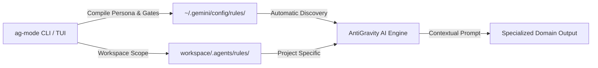

# ⚡ AG Mode (AntiGravity Mode Manager)

<p align="center">
  
</p>

<p align="center">
  <strong>Cross-Platform Mode, Persona, Rules, Knowledge & Quality-Control Engine for Google AntiGravity</strong>
</p>

<p align="center">
  <a href="https://github.com/Muhammad-Wasif/ag-mode/releases"></a>
  <a href="LICENSE"></a>
  <a href="https://www.python.org/"></a>
  
  
</p>

---

## 📖 Overview

**AG Mode** transforms your [Google AntiGravity](https://antigravity.google) AI assistant into an elite, domain-specialized engineer, scientist, or researcher in real time.

Instead of writing repetitive, exhaustive system prompts, **AG Mode** dynamically loads curated operating personas, domain heuristics, quality gates, and toolchain configurations directly into AntiGravity's rule-discovery engine—with **zero restarts required**.

Switch instantly between **Artificial Intelligence**, **Web Development**, **Chemistry**, **Cybersecurity**, **Digital Logic Design**, **Android Development**, and 70+ other specialized modes with a single keystroke or command.

---

## ⚡ Fast Installation & Downloads

Download the standalone, self-extracting one-click installer for your operating system from the [**Releases Page**](https://github.com/Muhammad-Wasif/ag-mode/releases/tag/v0.1.0):

| Platform | Installer Asset | Quick Run / Install |
| :--- | :--- | :--- |
| **Windows** (Batch) | [`ag-mode-v0.1.0-windows-setup.bat`](https://github.com/Muhammad-Wasif/ag-mode/releases/download/v0.1.0/ag-mode-v0.1.0-windows-setup.bat) | Double-click to install, or run in Command Prompt |
| **Windows** (PowerShell) | [`ag-mode-v0.1.0-windows-setup.ps1`](https://github.com/Muhammad-Wasif/ag-mode/releases/download/v0.1.0/ag-mode-v0.1.0-windows-setup.ps1) | `powershell -ExecutionPolicy Bypass -File ag-mode-v0.1.0-windows-setup.ps1` |
| **macOS** (Finder App) | [`ag-mode-v0.1.0-macos-setup.command`](https://github.com/Muhammad-Wasif/ag-mode/releases/download/v0.1.0/ag-mode-v0.1.0-macos-setup.command) | Double-click from Finder |
| **macOS** (Shell) | [`ag-mode-v0.1.0-macos-setup.sh`](https://github.com/Muhammad-Wasif/ag-mode/releases/download/v0.1.0/ag-mode-v0.1.0-macos-setup.sh) | `chmod +x ag-mode-v0.1.0-macos-setup.sh && ./ag-mode-v0.1.0-macos-setup.sh` |
| **Linux** (Script) | [`ag-mode-v0.1.0-linux-setup.sh`](https://github.com/Muhammad-Wasif/ag-mode/releases/download/v0.1.0/ag-mode-v0.1.0-linux-setup.sh) | `chmod +x ag-mode-v0.1.0-linux-setup.sh && ./ag-mode-v0.1.0-linux-setup.sh` |
| **Linux** (Portable) | [`ag-mode-v0.1.0-linux.tar.gz`](https://github.com/Muhammad-Wasif/ag-mode/releases/download/v0.1.0/ag-mode-v0.1.0-linux.tar.gz) | `tar -xzf ag-mode-v0.1.0-linux.tar.gz && ./ag-mode-manager/install.sh` |

### Installing via Git / Source
```bash
git clone https://github.com/Muhammad-Wasif/ag-mode.git
cd ag-mode
pip install -e .
```

---

## 🎮 Usage

Launch the interactive Terminal User Interface (TUI) anytime:

```bash
ag-mode
# or simply:
agmm
```

```text
+--------------------------------------------------------------------------+
|                           AG MODE MANAGER                                |
|                      AntiGravity Environment                             |
+--------------------------------------------------------------------------+
| Active Mode: * Artificial Intelligence                                   |
+--------------------------------------------------------------------------+
|  Categories:                                                             |
|  > Development              [9 modes]                                    |
|    Data & AI                [8 modes]                                    |
|    Cybersecurity            [6 modes]                                    |
|    Engineering              [7 modes]                                    |
|    Academic                 [5 modes]                                    |
|    Languages                [8 modes]                                    |
+--------------------------------------------------------------------------+
| [^v] Navigate   [Enter] Select   [Esc] Back   [/] Search   [Q] Quit      |
+--------------------------------------------------------------------------+
```

### CLI Commands Reference

| Command | Action |
| :--- | :--- |
| `ag-mode` | Launch the full interactive TUI mode picker |
| `ag-mode list` | Print all available built-in and custom modes |
| `ag-mode set <mode-id>` | Instantly activate a mode (e.g. `ag-mode set artificial-intelligence`) |
| `ag-mode status` | Show current active mode, scope, and health check |
| `ag-mode deactivate` | Clear active mode rules safely |
| `ag-mode compose <m1> <m2>` | Compose two or more modes together (e.g. `web-development` + `cyber-security`) |
| `ag-mode create` | Interactively scaffold a new custom domain mode |
| `ag-mode backup list` | List reversible snapshots |
| `ag-mode backup restore <id>` | Instantly restore a previous workspace configuration snapshot |
| `ag-mode doctor` | Run system self-test and verify AntiGravity connectivity |

---

## 🧠 How AntiGravity Detects & Adapts to Modes

AntiGravity incorporates an official hierarchical customization engine. **AG Mode** hooks into this architecture without ever modifying AntiGravity's binaries:



1. **Global Integration (`~/.gemini/config/rules/ag_active_mode.md`)**:
   Rules written here are automatically detected across **all** AntiGravity sessions and empty workspaces.
2. **Workspace Integration (`<project>/.agents/rules/`)**:
   Project-specific rules, quality gates, and interactive skills (`.agents/skills/ag-mode/SKILL.md`) dedicated to that repository.
3. **Automatic Mode Announcement**:
   AntiGravity reads the header and announces its active mode upon starting new sessions.
4. **Enforced Quality Gates**:
   AntiGravity enforces domain-specific validation checklists before generating or approving code.

---

## 🛠️ Built-in Mode Library

| Category | Modes Included |
| :--- | :--- |
| **Development** | Frontend Development, Backend Development, Fullstack Web, Android, iOS, Flutter, React, Vue, Next.js |
| **Data & AI** | Artificial Intelligence, Machine Learning, Deep Learning, Data Science, NLP, Computer Vision, MLOps |
| **Cybersecurity** | Ethical Hacking, Application Security, Network Defense, Penetration Testing, Cloud Security |
| **Engineering** | Digital Logic Design, Embedded Systems, IoT, Robotics, Electrical Engineering, DevOps |
| **Academic** | Chemistry, Physics, Mathematics, Biology, Academic Research, Bio-informatics |
| **Languages** | Python Master, Rust Systems, C/C++ Modern, Go, TypeScript/JavaScript, Java, C#/.NET |

---

## 🔒 Safety, Backup & Integrity Guarantee

- **Zero Binary Patching**: AG Mode never modifies, hooks, or injects into AntiGravity's executables or Electron packages.
- **Automated Snapshots**: Every time you activate or switch a mode, a snapshot of previous rules is automatically created.
- **Instant Rollback**: If you ever want to revert, run `ag-mode backup restore` or `ag-mode deactivate`.

---

## 🤝 Contributing

Contributions are welcome! To add a new domain mode:
1. Fork the repository
2. Create your mode under `modes/<your-mode-name>/`
   - Include `core.md`, `quality-gate.md`, and `tools.md`
3. Run the test suite:
   ```bash
   python -m unittest discover tests
   ```
4. Submit a Pull Request.

---

## 📄 License

This project is licensed under the [MIT License](LICENSE) - Copyright (c) 2026 **Muhammad Wasif**.
